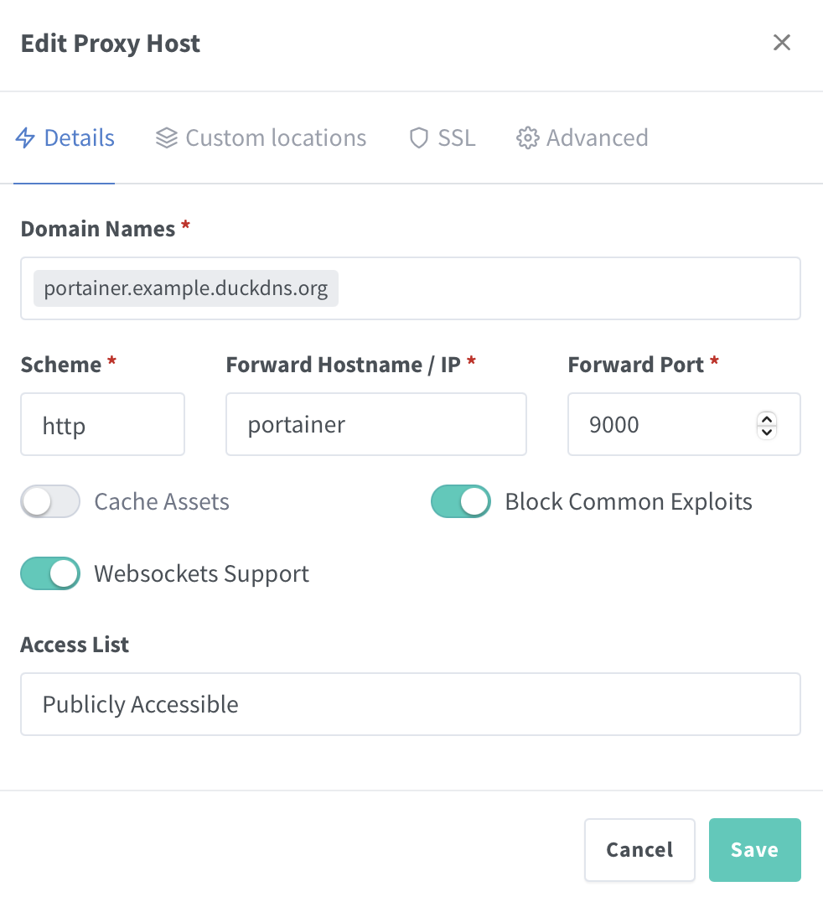

# 📦 Portainer Docker Compose Stack

[](LICENSE)
[](https://www.docker.com/)
[](https://openzfs.org/)

[](https://www.portainer.io/)

This repository provides a self-contained Docker Compose stack to run [Portainer CE](https://www.portainer.io/), a lightweight UI for managing Docker environments.

---

## 📁 Directory Structure

```bash
tank/
├── docker/
│   ├── compose/
│   │   └── portainer/              # Git repo lives here
│   │       ├── docker-compose.yml  # Main Docker Compose config
│   │       ├── .env                # Runtime environment variables and secrets (gitignored!)
│   │       ├── env.example         # Example .env file for reference
│   │       └── README.md           # This file
│   └── data/
│       └── portainer/              # Volume mounts and persistent data
```

---

## 🧰 Prerequisites

* Docker Engine
* Docker Compose V2
* Git
* (Optional) ZFS on Linux for dataset management

> ⚠️ **Note:** These instructions assume your ZFS pool is named `tank`. If your pool has a different name (e.g., `rpool`, `zdata`, etc.), replace `tank` in all paths and commands with your actual pool name.

---

## ⚙️ Setup Instructions

1. **Create the stack directory and clone the repository**

   If using ZFS:
   ```bash
   sudo zfs create -p tank/docker/compose/Portainer
   cd /tank/docker/compose/Portainer
   sudo git clone https://github.com/Vantasin/Portainer.git .
   ```

   If using standard directories:
   ```bash
   mkdir -p ~/docker/compose/Portainer
   cd ~/docker/compose/Portainer
   git clone https://github.com/Vantasin/Portainer.git .
   ```

2. **Create the runtime data directory**

   If using ZFS:
   ```bash
   sudo zfs create -p tank/docker/data/Portainer
   ```

   If using standard directories:
   ```bash
   mkdir -p ~/docker/data/Portainer
   ```

3. **Configure environment variables**

   Copy and modify the `.env` file:

   ```bash
   sudo cp env.example .env
   sudo nano .env
   sudo chmod 600 .env
   ```

   > **Note:** You only need to change the `.env` file if you are not using the default storage path.

4. **Start Portainer**

   ```bash
   docker compose up -d
   ```

---

## 🌐 Access Portainer

Once deployed, access **Portainer** using:

- **Web Interface:** Enter the URL for `Portainer`. Eg. `https://portainer.example.com`.

- **Initial Setup:** When you first access the web interface, you will be prompted to create an admin account.

> **Note:** You must use [Nginx Proxy Manager](https://github.com/Vantasin/Nginx-Proxy-Manager.git) as a reverse proxy to access `Portainer`.

> **Note:** Use `portainer` for the **Forward Hostname / IP** and `9000` for the **Forward Port**

<p align="center">
  
</p>

---

## 🙏 Acknowledgements

- [ChatGPT](https://openai.com/chatgpt) for assistance in generating setup scripts and templates.
- [Docker](https://www.docker.com/) for container orchestration and runtime.
- [ZFS](https://openzfs.org/) for advanced local filesystem features, dataset organization, and snapshotting.
- [Portainer](https://www.portainer.io/) — A powerful, open-source container management UI for Docker and Kubernetes.